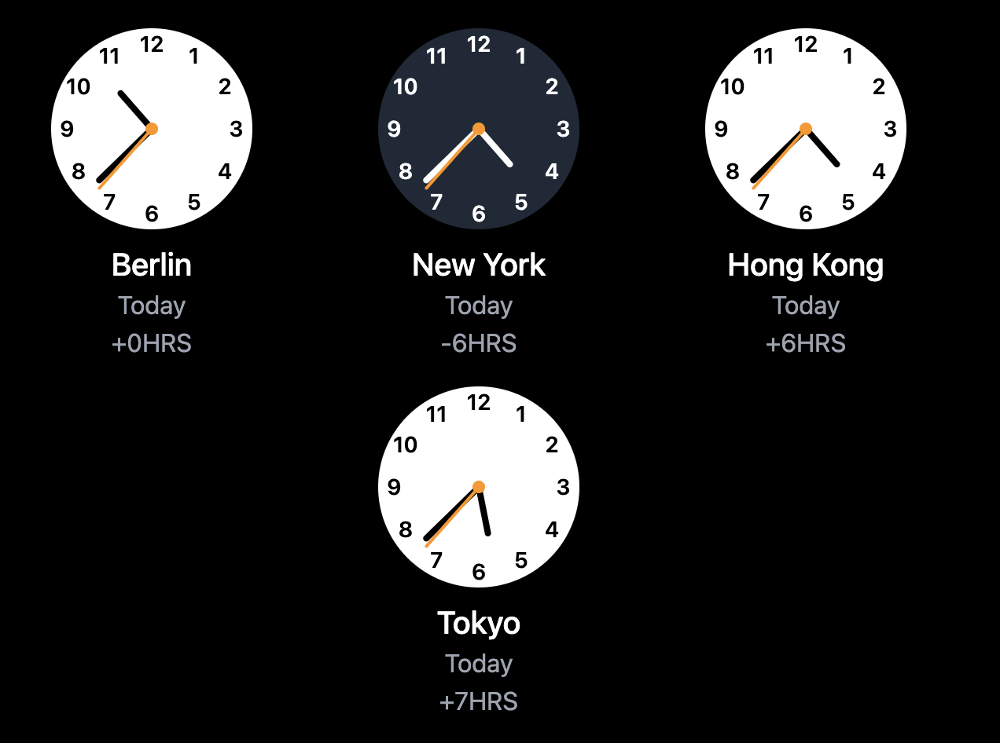

# Analog Clock iOS Style

A beautiful, customizable analog clock React component that mimics the iOS clock design. This component provides a sleek and modern look while maintaining high performance and flexibility.



## Features

- 🎨 iOS-style design with smooth animations
- ⚡️ Built with React and TypeScript
- 🎯 Fully customizable colors and sizes
- 📱 Responsive and mobile-friendly
- 🧪 Tested with Jest
- 🎭 Styled with Tailwind CSS
- 📦 Zero dependencies (except React)

## Installation

```bash
npm install analog-clock-ios-style
# or
yarn add analog-clock-ios-style
```

## Usage

```jsx
import { AnalogClock } from 'analog-clock-ios-style';
import 'analog-clock-ios-style/dist/index.css';

function App() {
  return (
    <div className="clock-container">
      <AnalogClock
        size={200}
        primaryColor="#000000"
        secondaryColor="#666666"
        backgroundColor="#ffffff"
      />
    </div>
  );
}
```

## Props

| Prop            | Type   | Default   | Description                        |
| --------------- | ------ | --------- | ---------------------------------- |
| size            | number | 200       | Size of the clock in pixels        |
| primaryColor    | string | '#000000' | Color of the hour and minute hands |
| secondaryColor  | string | '#666666' | Color of the second hand           |
| backgroundColor | string | '#ffffff' | Background color of the clock      |

## Development

1. Clone the repository:

```bash
git clone https://github.com/yourusername/analog-clock-ios-style.git
cd analog-clock-ios-style
```

2. Install dependencies:

```bash
npm install
```

3. Start development:

```bash
npm run build
```

## Scripts

- `npm run build` - Build the component
- `npm run test` - Run tests

## Contributing

Contributions are welcome! Please feel free to submit a Pull Request. For major changes, please open an issue first to discuss what you would like to change.

## License

This project is licensed under the MIT License - see the [LICENSE](LICENSE) file for details.

## Author

Hamed Montazeri

---

Made with ❤️ and React
